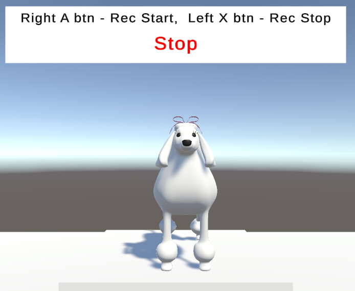

# talking with poodle

OpenAIのChatGPTとWhisperを使用してプードルと会話します.

- Windows PCと接続したQuest 2でテストしています。
- [Voice Recorder]スクリプトの、[Open AI Api Key]フィールドにOpenAIのAPIキーを入力してください。
- [Chat GPT System Contents]フィールドにはChatGPTの前提条件を入力してください。
- [SAPI Speech Synthesis]スクリプトの設定で言語を変更してください。
- 結構ChatGPTからの返事が遅い時があります。
- 発話記録時に画面が一瞬固まります。

発話開始時にAボタン、終了時にXボタンを押してください。

## Talking With Poodle Using DictationRecognizer
DictationRecognizerを使用して音声認識したバージョンです。  
https://learn.microsoft.com/ja-jp/windows/mixed-reality/develop/unity/voice-input-in-unity#dictation

Windowsの機能を使用しているのでWindows側の設定を行ってください。  
- [Settings]-[Privacy]-[Speech] の [Online speech recognition] を On にする。
- [Settings]-[System]-[Sound]-[Input]-[Choose your input device] で使用するマイクを設定する。(マイクとスピーカーはQuestのものを使用する)
- [Settings]-[Time & Language]-[Speech]-[Speech language] を [Japanese] にする。（日本語の場合）
